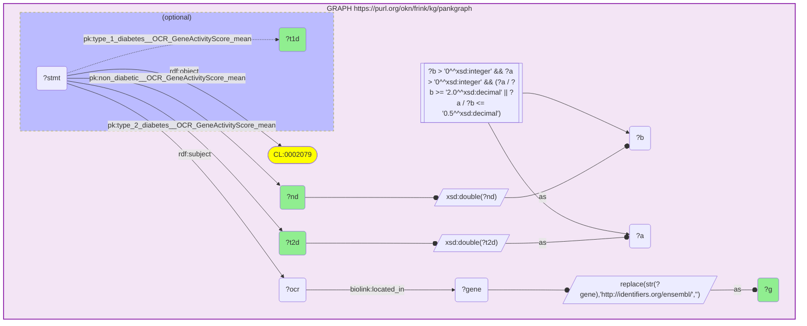
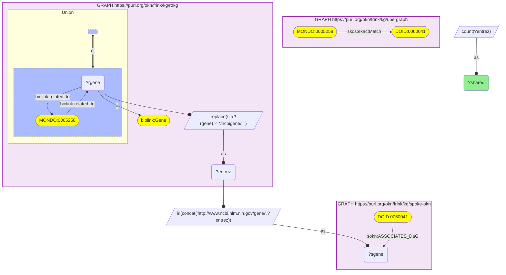

# sparql-to-mermaid

Render a SPARQL query as a [Mermaid](https://mermaid.js.org) `graph TD` diagram.

This is a pure-Python port of the SPARQL→Mermaid converter in the Java project
[`sparql-examples-utils`](https://github.com/sib-swiss/sparql-examples-utils)
(the `convert -m` / `mermaid` package). It is built on
[rdflib](https://rdflib.readthedocs.io)'s SPARQL algebra, so it needs no JVM and
can be used directly from Python services such as the `mcp-okn` server.

## Install

```bash
uv sync            # or: pip install -e .
```

Requires Python ≥ 3.10 and rdflib ≥ 7.

## Usage

```python
from sparql_to_mermaid import to_mermaid

diagram = to_mermaid("""
PREFIX rdfs: <http://www.w3.org/2000/01/rdf-schema#>
PREFIX SWISSLIPID: <https://swisslipids.org/rdf/SLM_>
SELECT ?category ?label WHERE {
  ?category SWISSLIPID:rank SWISSLIPID:Category .
  ?category rdfs:label ?label .
}
""")
print(diagram)
```

- `to_mermaid(query, prefixes=None, base=...)` returns the diagram string and
  raises `SparqlToMermaidError` if the query cannot be parsed.
- `try_to_mermaid(query, ...)` returns `None` (and logs) instead of raising —
  mirroring the Java behaviour of skipping queries it cannot transform.
- `prefixes` (a `{name: namespace}` dict) supplements the query's own `PREFIX`
  declarations when shortening IRIs.

### Command line

````text
sparql-to-mermaid query.rq            # prints the diagram
sparql-to-mermaid query.rq --fence    # wraps it in a ```mermaid code fence
cat query.rq | sparql-to-mermaid      # reads stdin
````

## What is rendered

The same visual grammar as the Java tool: basic graph patterns (constant
predicates as edge labels, `rdf:type` as `"a"`), `OPTIONAL` (dotted arrows in a
blue dashed subgraph), `UNION`, `FILTER` (with `EXISTS` and `IN`), `BIND`,
`VALUES`, `SERVICE`, `MINUS`, aggregates, and property paths. Projected
variables, IRIs and literals get the `projected` / `iri` / `literal` styles.

Named graphs (`GRAPH <iri> { … }` or `GRAPH ?g { … }`) render as a titled
purple subgraph box. Constants are scoped to their box, so a reference IRI that
appears in several `GRAPH` blocks is drawn once inside each — a single shared
node cannot belong to two Mermaid subgraphs and would make the boxes overlap.
Variables stay shared across boxes, so a variable that joins two named graphs
remains one node with edges crossing the box boundaries.

### Example: a single named graph

A query against one named graph of the pancreas knowledge graph
[`pankgraph`](https://frink.renci.org/), combining a basic graph pattern with an
`OPTIONAL`, a compound `FILTER` (booleans, arithmetic and typed literals), and
several `BIND` steps — including `xsd:double(…)` casts and a `REPLACE(…)` that
strips a gene IRI down to its Ensembl id:

```sparql
PREFIX rdf: <http://www.w3.org/1999/02/22-rdf-syntax-ns#>
PREFIX rdfs: <http://www.w3.org/2000/01/rdf-schema#>
PREFIX xsd: <http://www.w3.org/2001/XMLSchema#>
PREFIX pk: <https://purl.org/okn/frink/kg/pankgraph/schema/>
PREFIX biolink: <https://w3id.org/biolink/vocab/>
SELECT ?g ?t2d ?nd ?t1d WHERE {
  GRAPH <https://purl.org/okn/frink/kg/pankgraph> {
    ?stmt rdf:subject ?ocr ; rdf:object <http://purl.obolibrary.org/obo/CL_0002079> ;
          pk:type_2_diabetes__OCR_GeneActivityScore_mean ?t2d ;
          pk:non_diabetic__OCR_GeneActivityScore_mean ?nd .
    ?ocr biolink:located_in ?gene .
    OPTIONAL { ?stmt pk:type_1_diabetes__OCR_GeneActivityScore_mean ?t1d }
    BIND(xsd:double(?t2d) AS ?a) BIND(xsd:double(?nd) AS ?b)
    FILTER(?b > 0 && ?a > 0 && (?a/?b >= 2.0 || ?a/?b <= 0.5))
    BIND(REPLACE(STR(?gene), "http://identifiers.org/ensembl/", "") AS ?g)
  }
}
```

The whole pattern sits inside the single `GRAPH` box; the `OPTIONAL` nests as a
blue dashed subgraph, the `FILTER` node feeds the variables it constrains, and
each `BIND` reshapes a value with `--o` inputs and an `--as--o` output:



### Example: a multi-graph federated query

This query counts the genes shared between two equivalent disease concepts by
joining three named graphs of the [Proto-OKN](https://frink.renci.org/) federation
— `ubergraph` (the disease cross-reference), `rdkg` (disease→gene relations), and
`spoke-okn` (disease→gene associations):

```sparql
PREFIX skos: <http://www.w3.org/2004/02/skos/core#>
PREFIX biolink: <https://w3id.org/biolink/vocab/>
PREFIX sokn: <https://purl.org/okn/frink/kg/spoke-okn/schema/>
SELECT (COUNT(DISTINCT ?entrez) AS ?shared) WHERE {
  GRAPH <https://purl.org/okn/frink/kg/ubergraph> {
    <http://purl.obolibrary.org/obo/MONDO_0005258> skos:exactMatch <http://purl.obolibrary.org/obo/DOID_0060041> .
  }
  GRAPH <https://purl.org/okn/frink/kg/rdkg> {
    { <http://purl.obolibrary.org/obo/MONDO_0005258> biolink:related_to ?rgene }
    UNION { ?rgene biolink:related_to <http://purl.obolibrary.org/obo/MONDO_0005258> }
    ?rgene a biolink:Gene .
    BIND(REPLACE(STR(?rgene), '^.*/ncbigene/', '') AS ?entrez)
  }
  BIND(IRI(CONCAT('http://www.ncbi.nlm.nih.gov/gene/', ?entrez)) AS ?sgene)
  GRAPH <https://purl.org/okn/frink/kg/spoke-okn> {
    <http://purl.obolibrary.org/obo/DOID_0060041> sokn:ASSOCIATES_DaG ?sgene .
  }
}
```

Each `GRAPH` becomes a self-contained box; the `?entrez`/`?sgene` variables and
the two `BIND` steps that reshape a gene identifier between graphs cross the box
boundaries, and `count(?entrez)` feeds the projected `?shared` result:



## Fidelity

The bar is **structural equivalence**, not byte-for-byte identity with the Java
output. rdflib normalizes the SPARQL algebra differently from RDF4j, so node ids
(`v1`, `c2`, …) and line ordering can differ, but the diagram shows the same
nodes, edges and structural blocks. Notable differences from the Java port:

- **Property paths** (`*`, `+`, `/`, `^`, `|`) are rendered as a single edge
  label (e.g. `rdfs:subClassOf*`). RDF4j desugars these into separate patterns;
  rdflib keeps them as a path object, which reads more compactly.
- **Aggregates:** rdflib adds a synthetic `SAMPLE` per `GROUP BY` key; those are
  suppressed so only user-written aggregates appear.
- **Parser coverage** differs from RDF4j: some vendor-specific queries
  (Wikidata/Blazegraph extensions) that RDF4j accepts may fail to parse here, and
  vice versa. Use `try_to_mermaid` to skip such queries gracefully.

See [`docs/PORTING_NOTES.md`](docs/PORTING_NOTES.md) for the full Java→Python
module map and the design decisions behind the port.

## Tests

```bash
uv run pytest
```

The suite ports the Java unit-test fixtures (as raw query strings) and adds a
structural marker check for each SPARQL feature.
