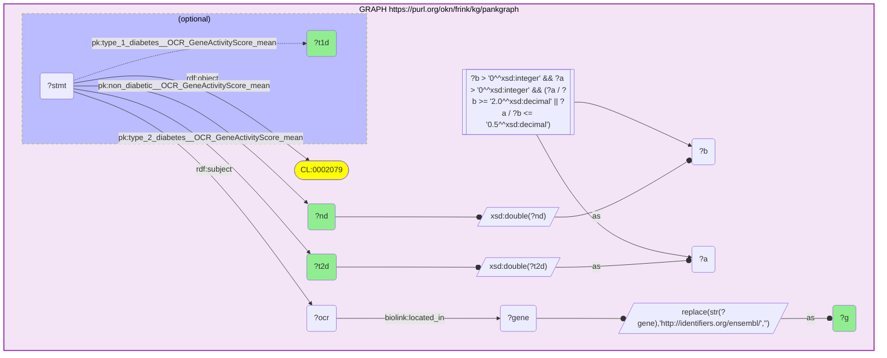
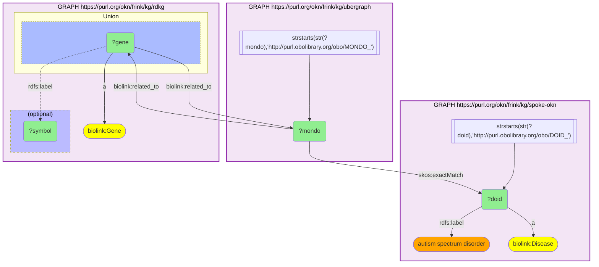

# sparql-to-mermaid

Render a SPARQL query as a [Mermaid](https://mermaid.js.org) `graph TD` diagram.

This is a pure-Python port of the SPARQL→Mermaid converter in the Java project
[`sparql-examples-utils`](https://github.com/sib-swiss/sparql-examples-utils)
(the `convert -m` / `mermaid` package). It is built on
[rdflib](https://rdflib.readthedocs.io)'s SPARQL algebra, so it needs no JVM and
can be used directly from Python services such as the
[`mcp-okn`](https://github.com/sbl-sdsc/mcp-okn) server.

## Install

```bash
uv sync            # or: pip install -e .
```

Requires Python ≥ 3.10 and rdflib ≥ 7.

## Usage

```python
from sparql_to_mermaid import to_mermaid

diagram = to_mermaid("""
PREFIX rdfs: <http://www.w3.org/2000/01/rdf-schema#>
PREFIX SWISSLIPID: <https://swisslipids.org/rdf/SLM_>
SELECT ?category ?label WHERE {
  ?category SWISSLIPID:rank SWISSLIPID:Category .
  ?category rdfs:label ?label .
}
""")
print(diagram)
```

- `to_mermaid(query, prefixes=None, base=...)` returns the diagram string and
  raises `SparqlToMermaidError` if the query cannot be parsed.
- `try_to_mermaid(query, ...)` returns `None` (and logs) instead of raising —
  mirroring the Java behaviour of skipping queries it cannot transform.
- `prefixes` (a `{name: namespace}` dict) supplements the query's own `PREFIX`
  declarations when shortening IRIs.
- `collapse_empty_unions` (default `True`) is a cosmetic pass: when both arms of
  a `UNION` reference the same nodes, Mermaid renders one arm as an empty box, so
  this unwraps that empty arm (keeping its edges) and drops the dangling `or`
  connector. Pass `False` for output identical to the Java tool.
- `max_values` (default `3`) caps how many values a `VALUES` clause draws. A long
  inline list otherwise fans out to one node per value; once a list has more than
  `max_values`, the first `max_values` are drawn and the tail collapses into a
  single `+N more` node. Pass `None` to draw every value (the previous behaviour).
  Lists of `max_values` or fewer are unaffected.

### Command line

````text
sparql-to-mermaid query.rq                          # prints the diagram
sparql-to-mermaid query.rq --fence                  # wraps it in a ```mermaid code fence
sparql-to-mermaid query.rq --no-collapse-empty-unions  # keep empty UNION arm boxes (Java-identical)
sparql-to-mermaid query.rq --max-values 20          # draw up to 20 VALUES values, then "+N more"
sparql-to-mermaid query.rq --no-max-values          # draw every VALUES value (no collapsing)
cat query.rq | sparql-to-mermaid                    # reads stdin
````

## What is rendered

The same visual grammar as the Java tool: basic graph patterns (constant
predicates as edge labels, `rdf:type` as `"a"`), `OPTIONAL` (dotted arrows in a
blue dashed subgraph), `UNION`, `FILTER` (with `EXISTS` and `IN`), `BIND`,
`VALUES`, `SERVICE`, `MINUS`, aggregates, and property paths. Projected
variables, IRIs and literals get the `projected` / `iri` / `literal` styles.

Node and edge labels are always quoted and escaped, so an IRI or annotation
containing a character Mermaid treats specially — most commonly a `(` in a full
IRI, as in some Reactome/PubChem identifiers — can't derail the parser and leave
the diagram rendering as raw text. Subgraph titles (`GRAPH`, `Union`,
`(optional)`, `MINUS`, `SERVICE`, `Exists Clause`) are forced black (`color:#000`)
so they stay readable under viewer themes that would otherwise render cluster
labels in a light color.

One deliberate difference from the Java tool: a `VALUES` clause with more than
`max_values` (default 3) values no longer draws one node per value — it draws the
first `max_values` and collapses the rest into a single `+N more` node, so a long
inline list stays compact. Pass `--no-max-values` (or `max_values=None`) for the
previous all-values output.

Named graphs (`GRAPH <iri> { … }` or `GRAPH ?g { … }`) render as a titled
purple subgraph box. Constants are scoped to their box, so a reference IRI that
appears in several `GRAPH` blocks is drawn once inside each — a single shared
node cannot belong to two Mermaid subgraphs and would make the boxes overlap.
Variables stay shared across boxes, so a variable that joins two named graphs
remains one node with edges crossing the box boundaries.

The same single-node limitation shows up in `UNION`: when both arms reference the
same nodes (e.g. one triple written in both directions), Mermaid can only place
those nodes in one arm, so the other arm would render as an empty box tied on by
the `or` connector. By default that empty arm is unwrapped (keeping its edges) and
the `or` connector dropped; pass `collapse_empty_unions=False`
(or `--no-collapse-empty-unions`) for output identical to the Java tool, which
leaves the empty box in place.

### Example: a single named graph

A query against one named graph of the pancreas knowledge graph
[`pankgraph`](https://frink.renci.org/), combining a basic graph pattern with an
`OPTIONAL`, a compound `FILTER` (booleans, arithmetic and typed literals), and
several `BIND` steps — including `xsd:double(…)` casts and a `REPLACE(…)` that
strips a gene IRI down to its Ensembl id:

```sparql
PREFIX rdf: <http://www.w3.org/1999/02/22-rdf-syntax-ns#>
PREFIX rdfs: <http://www.w3.org/2000/01/rdf-schema#>
PREFIX xsd: <http://www.w3.org/2001/XMLSchema#>
PREFIX pk: <https://purl.org/okn/frink/kg/pankgraph/schema/>
PREFIX biolink: <https://w3id.org/biolink/vocab/>
SELECT ?g ?t2d ?nd ?t1d WHERE {
  GRAPH <https://purl.org/okn/frink/kg/pankgraph> {
    ?stmt rdf:subject ?ocr ; rdf:object <http://purl.obolibrary.org/obo/CL_0002079> ;
          pk:type_2_diabetes__OCR_GeneActivityScore_mean ?t2d ;
          pk:non_diabetic__OCR_GeneActivityScore_mean ?nd .
    ?ocr biolink:located_in ?gene .
    OPTIONAL { ?stmt pk:type_1_diabetes__OCR_GeneActivityScore_mean ?t1d }
    BIND(xsd:double(?t2d) AS ?a) BIND(xsd:double(?nd) AS ?b)
    FILTER(?b > 0 && ?a > 0 && (?a/?b >= 2.0 || ?a/?b <= 0.5))
    BIND(REPLACE(STR(?gene), "http://identifiers.org/ensembl/", "") AS ?g)
  }
}
```

The whole pattern sits inside the single `GRAPH` box; the `OPTIONAL` nests as a
blue dashed subgraph, the `FILTER` node feeds the variables it constrains, and
each `BIND` reshapes a value with `--o` inputs and an `--as--o` output:



### Example: a multi-graph federated query

This query starts from a disease *label*, resolves it to a DOID in `spoke-okn`,
crosswalks that to the equivalent MONDO id through `ubergraph`, then pulls the
related genes from `rdkg` — three named graphs of the
[Proto-OKN](https://frink.renci.org/) federation joined on shared variables:

```sparql
PREFIX rdfs: <http://www.w3.org/2000/01/rdf-schema#>
PREFIX skos: <http://www.w3.org/2004/02/skos/core#>
PREFIX biolink: <https://w3id.org/biolink/vocab/>
SELECT DISTINCT ?doid ?mondo ?gene ?symbol WHERE {
  GRAPH <https://purl.org/okn/frink/kg/spoke-okn> {
    ?doid a biolink:Disease ; rdfs:label "autism spectrum disorder" .
    FILTER(STRSTARTS(STR(?doid), 'http://purl.obolibrary.org/obo/DOID_'))
  }
  GRAPH <https://purl.org/okn/frink/kg/ubergraph> {
    ?mondo skos:exactMatch ?doid .
    FILTER(STRSTARTS(STR(?mondo), 'http://purl.obolibrary.org/obo/MONDO_'))
  }
  GRAPH <https://purl.org/okn/frink/kg/rdkg> {
    { ?mondo biolink:related_to ?gene } UNION { ?gene biolink:related_to ?mondo }
    ?gene a biolink:Gene .
    OPTIONAL { ?gene rdfs:label ?symbol }
  }
}
```

Each `GRAPH` becomes a self-contained box. The `?doid` and `?mondo` variables are
shared across boxes, so the `skos:exactMatch` and `biolink:related_to` joins draw
as edges crossing the box boundaries, and each `FILTER(STRSTARTS(…))` renders as a
node feeding the variable it constrains. The `rdkg` `UNION` writes the same triple
in both directions, so its two arms reference the same nodes; the arm Mermaid would
otherwise leave as an empty box is dropped by default (pass
`--no-collapse-empty-unions` to keep it):



## Fidelity

The bar is **structural equivalence**, not byte-for-byte identity with the Java
output. rdflib normalizes the SPARQL algebra differently from RDF4j, so node ids
(`v1`, `c2`, …) and line ordering can differ, but the diagram shows the same
nodes, edges and structural blocks. Notable differences from the Java port:

- **Property paths** (`*`, `+`, `/`, `^`, `|`) are rendered as a single edge
  label (e.g. `rdfs:subClassOf*`). RDF4j desugars these into separate patterns;
  rdflib keeps them as a path object, which reads more compactly.
- **Aggregates:** rdflib adds a synthetic `SAMPLE` per `GROUP BY` key; those are
  suppressed so only user-written aggregates appear.
- **Parser coverage** differs from RDF4j: some vendor-specific queries
  (Wikidata/Blazegraph extensions) that RDF4j accepts may fail to parse here, and
  vice versa. Use `try_to_mermaid` to skip such queries gracefully.
- **Named graphs (`GRAPH`)** — a port addition for multi-graph queries — render
  as titled subgraph boxes (see the [multi-graph example](#example-a-multi-graph-federated-query)).
  Constants are scoped per box, so a reference IRI shared across `GRAPH` blocks is
  drawn once inside each (a single node cannot span two Mermaid subgraphs);
  variables stay shared, so a variable joining two graphs stays one node with
  edges crossing the box boundaries.
- **Empty `UNION` arms** are collapsed by default: when both arms reference the
  same nodes the Java tool leaves one arm as an empty box, which this port unwraps.
  Pass `collapse_empty_unions=False` (or `--no-collapse-empty-unions`) to reproduce
  the Java output exactly.

See [`docs/PORTING_NOTES.md`](docs/PORTING_NOTES.md) for the full Java→Python
module map and the design decisions behind the port.

## Tests

```bash
uv run pytest
```

The suite ports the Java unit-test fixtures (as raw query strings) and adds a
structural marker check for each SPARQL feature.

## License

This project's own code is released under the [BSD 3-Clause License](LICENSE)
(© Structural Bioinformatics Laboratory).

The SPARQL→Mermaid rendering logic is a port of the `mermaid` package of
[`sparql-examples-utils`](https://github.com/sib-swiss/sparql-examples-utils),
which is distributed under the MIT License (© 2024 SIB Swiss Institute of
Bioinformatics). That upstream copyright and permission notice is retained in
the [NOTICE](NOTICE) file, as the MIT License requires.

## Citation & acknowledgments

This work would not exist without the
[`sparql-examples-utils`](https://github.com/sib-swiss/sparql-examples-utils)
project by the SIB Swiss Institute of Bioinformatics — its `mermaid` converter
is the original this port faithfully reproduces. If you use `sparql-to-mermaid`,
please also cite the upstream work:

> Bolleman J., Emonet V., Altenhoff A., *et al.* *A large collection of
> bioinformatics question-query pairs over federated knowledge graphs:
> methodology and applications.* GigaScience, 2024.
> doi:[10.1093/gigascience/giaf045](https://doi.org/10.1093/gigascience/giaf045)

A [`CITATION.cff`](CITATION.cff) is provided for GitHub's "Cite this repository"
feature; it references both this software and the paper above.
